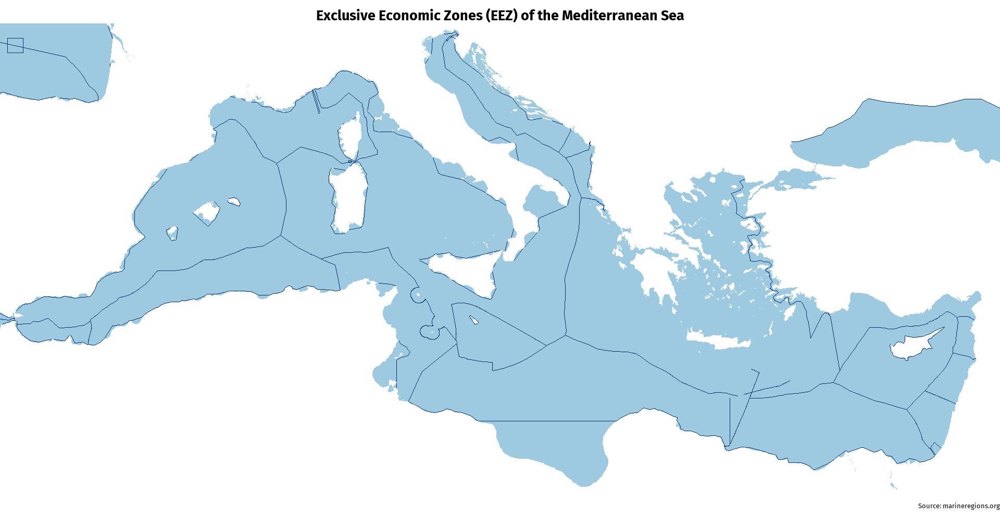
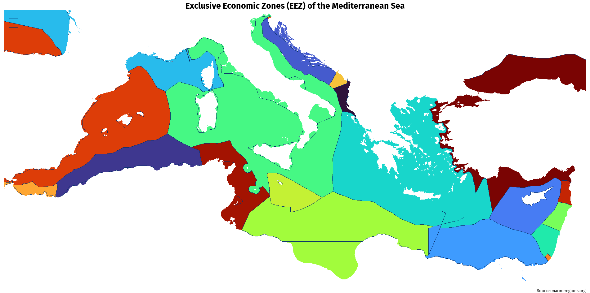

## 🌊 Exclusive Economic Zones (EEZ) in the Mediterranean Sea

This project visualizes the **Exclusive Economic Zones (EEZ)** in the Mediterranean Sea using open marine boundaries data from [MarineRegions.org](https://www.marineregions.org/).

### 📷 Visuals

#### 🗺️ Clean map (no borders or flags)

*A neutral map showing only EEZ boundaries with clean styling.*

---

#### 🟥 EEZ by country zones (colored areas)

*Each zone is colored differently by country ownership.*

---

#### 🇺🇳 EEZ + country flags as background

!\[EEZ over flags]\(exclusive economic zones in the Mediterranean Sea.jpg)
*Overlay of EEZ zones on top of national flags for a geopolitical look.*

---

#### 🎌 Flag-only version

!\[Flags only]\(EEZ in the Mediterranean Sea.jpg)
*Each EEZ zone is fully filled with the national flag of the country that claims it.*

---

## 📜 R Code Description

The main script is: `EEZ of the Mediterranean Sea.R`

This script:

1. Loads the official EEZ shapefile from Marine Regions.
2. Filters out only Mediterranean-bordering countries.
3. Clips the geometry to the Mediterranean bounding box (`-6 to 37°E`, `30 to 46°N`).
4. Computes area (`km²`) of each EEZ and its share in percent.
5. Visualizes EEZs using `ggplot2` in different styles.

---

### 🔍 Data Source

* Flanders Marine Institute (2023). *Maritime Boundaries Geodatabase, version 12*.

